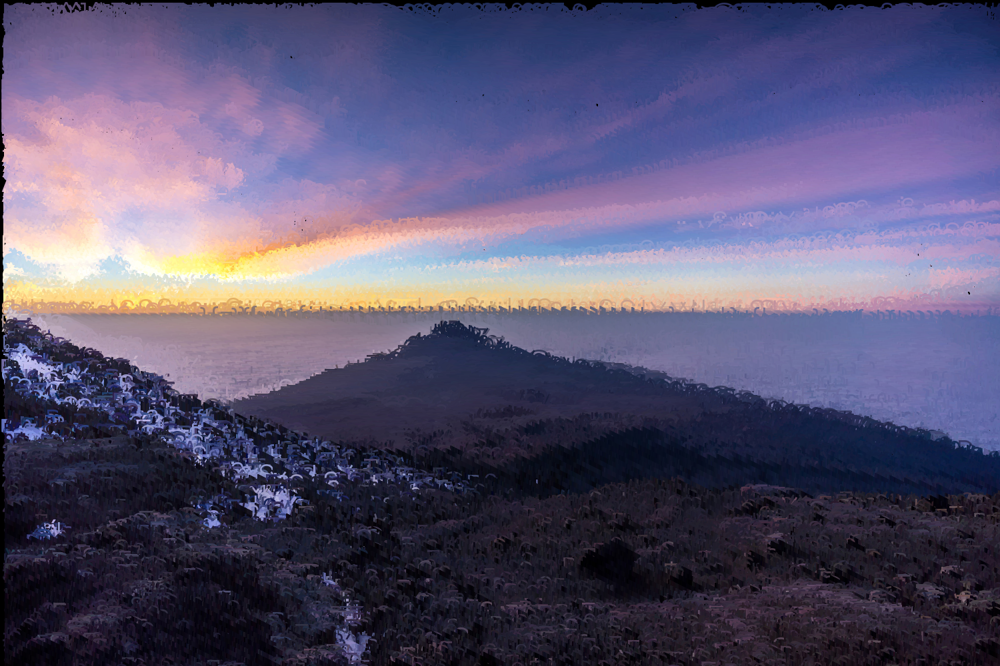

<p align="center">
  <h3 align="center">Photo to ASCII Art</h3>
</p>


## Spis treści

* [About](#About)
* [Instalation](#Instalation)
* [Usage](#Usage)
    * [Examples](#Examples)
    * [Options](#Options)
* [Licence](#Licence)
* [Contact](#Contact)
* [Sources](#Sources)


# About
Autor: Matas Pieczulis

Photo-ASCII is a single file python3 library that let you replace every pixel with ASCII character. Every pixel gets avrage value calculated from color and then this value is used in char() to get ASCII characters.

Example images are located at img/

# Instalation

1. Clone:
```sh
git clone https://github.com/Sekyzio/Photo-Ascii.git
```
2. Install requirements:
```sh
python3 pip install -r requirements.txt 
```

# Usage

To run this program you need to specify few arguments:
* Name of source image
* Scale
* Sampling
* Font size
* Pixels shifed to right

```sh
main.py image.jpg 1 128 40 2
```

New image will be created as output.png

## Examples

```sh
main.py preview-color.jpg 1 15 40 2 -c -e 
```

Original image:


ASCII image:



```sh
main.py preview2-color.jpeg 1 31 50 2 -c
```
Original image:


ASCII image:


## Options
 ```sh
-help          Standard help 
-c             Colored version
-e             Extended ASCII characters
-r             Set background white and characters white (useful with mono images)
 ```

# Licence

Distributed under the MIT License. See `LICENSE` for more information.

# Contact

Email: mateuszpieczulis123@gmail.com 

Github: [https://github.com/Sekyzio](https://github.com/Sekyzio)


# Sources
* preview-color.jpg: https://iso.500px.com/wp-content/uploads/2016/02/stock-photo-133673159-1500x1000.jpg
* preview-color2.jpeg: https://external-content.duckduckgo.com/iu/?u=https%3A%2F%2Fiso.500px.com%2Fwp-content%2Fuploads%2F2016%2F02%2Fstock-photo-141823007-1500x1000.jpg&f=1&nofb=1
* preview-color3.jpeg: https://i.ytimg.com/vi/EWYnStXlCVE/maxresdefault.jpg
